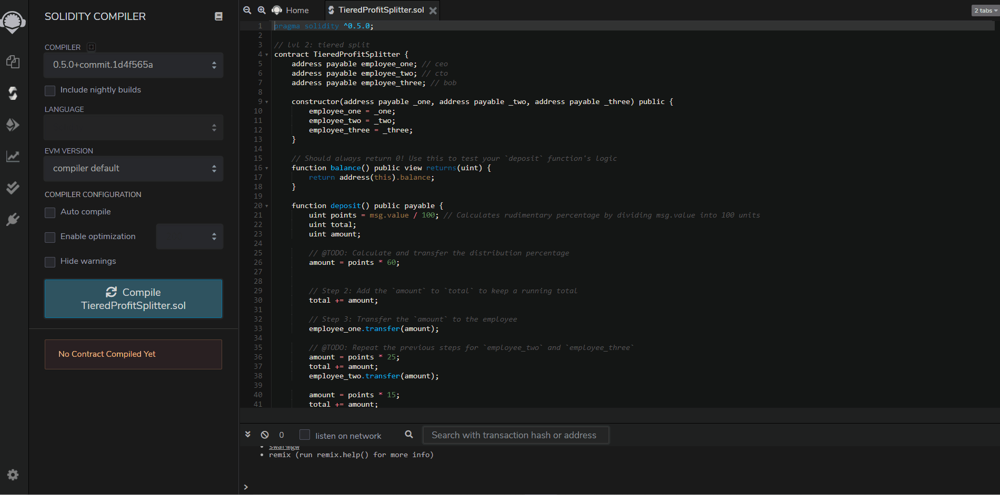

# Ethereum - Compatible Blockchain

This assignment includes 3 profit splitter contracts, which will pay your associate-level employees quickly and easily, distribute profits to different tiers of employees, and distribute company shares for employees in a "deferred equity incentive plan" automatically.

#

* ### First Contract: Associate Profit Splitter

This will accept Ether into the contract and divide the Ether evenly among the associate level employees. This will allow the Human Resources department to pay employees quicky and efficiently. 

 After compiling the contract, add three wallet address of the employees into the deploy function and click transact. This will create a contract where you can then enter the amount of Ether to deposit to the given wallet addresses created in the contract. As seen below, an amount of 15 Ether was inputed into the value slot and executed via deposit function. You can see in the end an amount 5 Ether was evenly deposited into the three wallet addresses. 

#

* ### Second Contract: Tiered Profit Splitter

This contract will distribute Ether to employees in different percentages that are in different tiers/levels. 

In this demonstration below, the first employee (CEO) gets paid 60%, second employee (CTO) 25% and third employee (Bob) 15%. As you can see below, an amount of 80 Ether were distributed accordingly. CEO gets [(80/100) x 60] = 48 Ether, CTO [(80/100 x 25)] = 20 Ether, and lastly Bob gets [(80/100 x 15)] = 12 Ether respectively. 

#

* ### Third Contract: Deferred Equity Plan

This contract models company stock plans. It will automatically manage 1000 shares with an annual distribution of 250 over 4 years for a single employee. 

Here we will demonstrate by adding a fastforward function to proceed to the following year to show how it will actually payout the shares every year to a single employee. Please observe the distributed shares function below as it increases by 250, after using the fastforward function to allow the distribute function to send out shares every year. Also, notice in the end, once you reach the total shares amount of 1000, it sends out a message "Error, exceeded total shares" to prevent from over compensating an employee accidentally.

